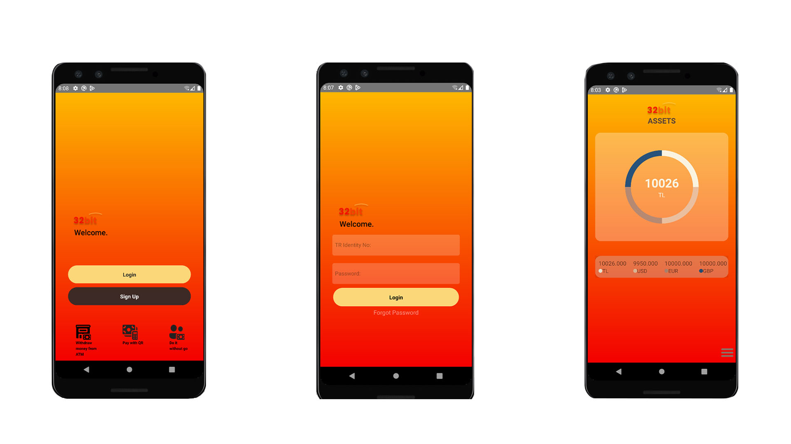
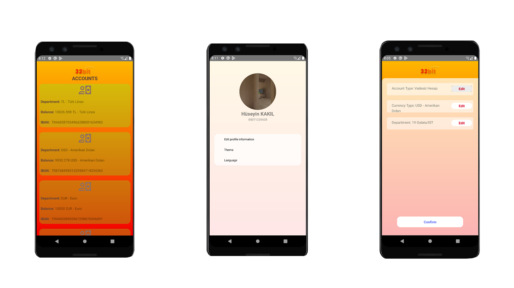
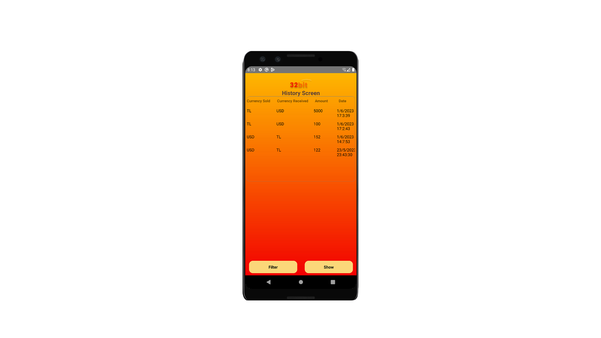

# 									Currency App
## Introduce
- [Used Technologies](https://github.com/hsynkkl/proje-doviz#used-technologies)
- [Usage](https://github.com/hsynkkl/proje-doviz#usage)
- [Screenshots](https://github.com/hsynkkl/proje-doviz#screenshots)

## Used Technologies
- [React Native](https://reactnative.dev/)
- [SQLite](https://sqlite.org/index.html)

## Usage

## Install
- git clone https://github.com/hsynkkl/proje-doviz  

## Setup
- Install packages with `npm install`.

## Start
- cd proje-doviz/exchangeApp  
- npx react-native start  
- npx react-native run-android  
- cd proje-doviz/backend  
- nodemon index.js  

## Screenshots

  
  
  
