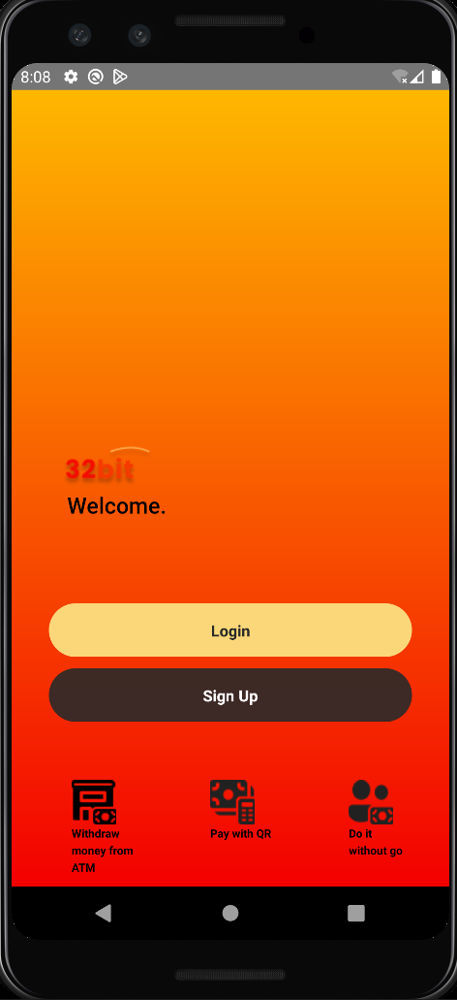
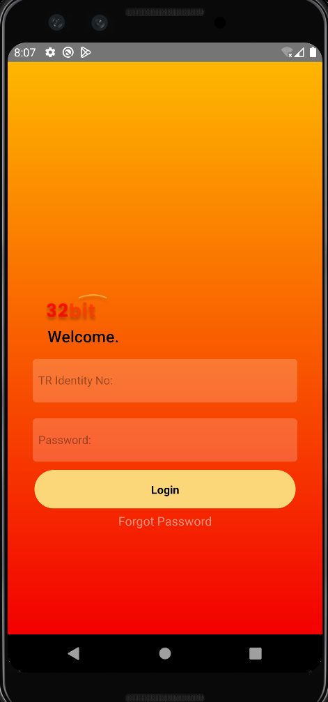
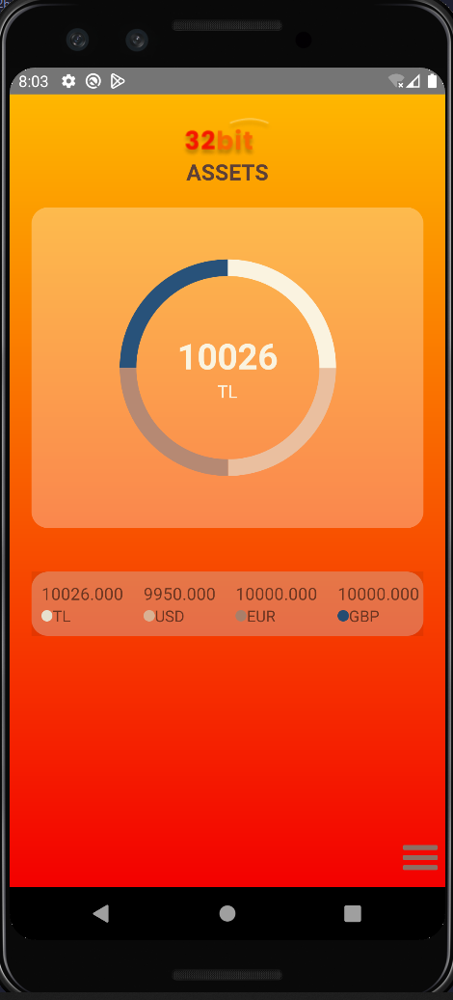
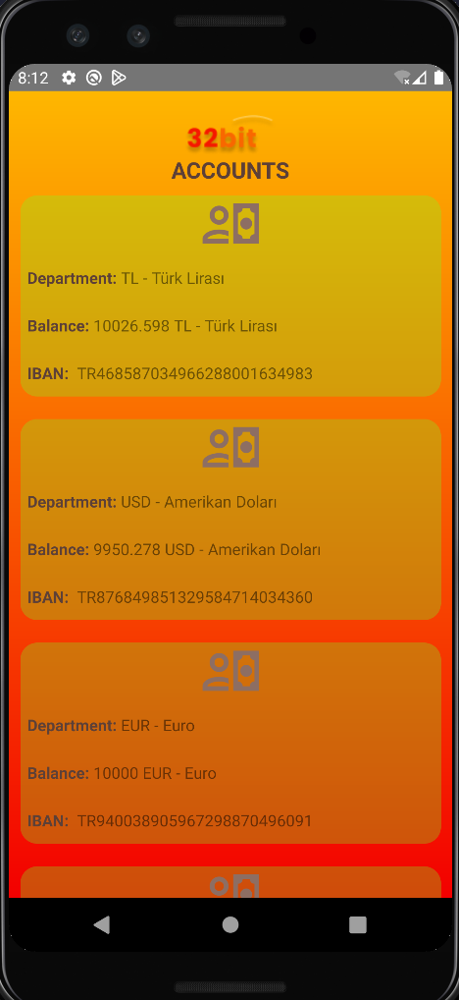
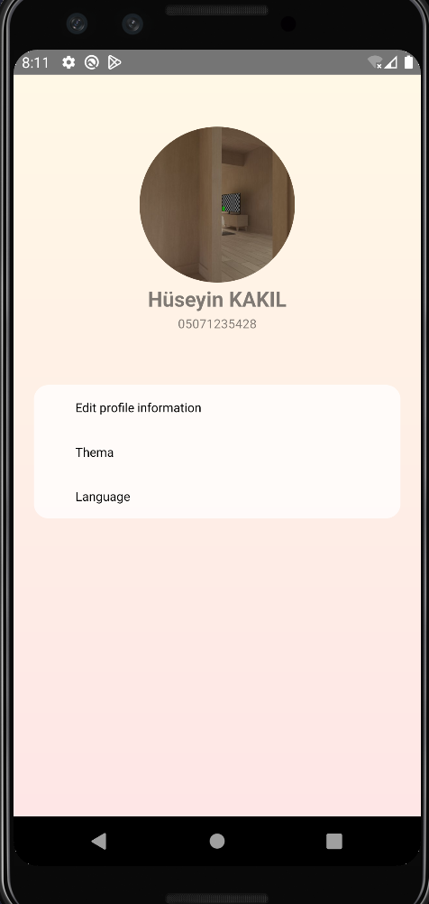
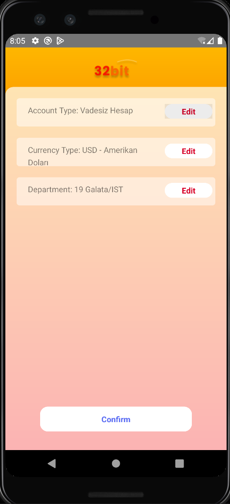
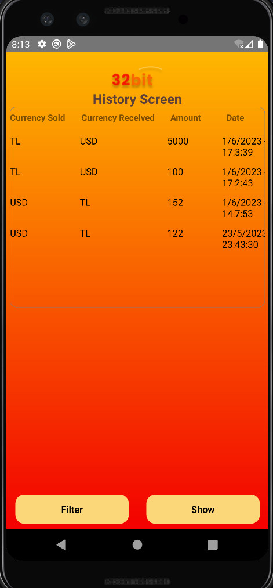

# 									Currency App
## Introduce
- Used Technologies
- Usage
- Screenshots

## Used Technologies
- React Native
- SQLite

## Usage

## Install
- git clone https://github.com/hsynkkl/proje-doviz  

## Setup
- Install packages with `npm install`.

## Start
- cd proje-doviz/exchangeApp  
- npx react-native start  
- npx react-native run-android  
- cd proje-doviz/backend  
- nodemon index.js  

## Screenshots

 &#160;  &#160;   

  &nbsp;  &nbsp;  &nbsp; 
